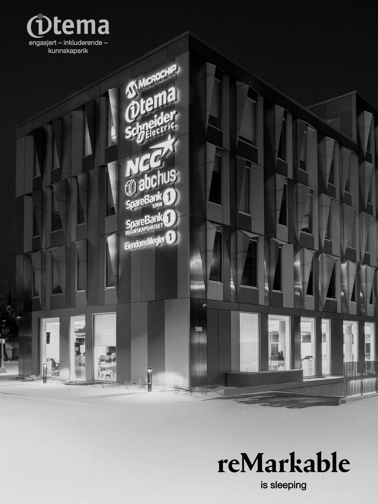

# Itema-tilpassede skjermbilder og maler for reMarkable


For å kunne endre på systemfilene til reMarkable, så må man ha tilgang til enheten gjennom [SSH](https://remarkablewiki.com/tech/ssh).


## Skjermbilder

Vi har foreløpig kun ett skjermbilde. Dette bildet vises når reMarkable er i sovemodus, hvilket er den tilstanden den havner i når man trykker lett på knappen mens enheten er på – eller det går en viss tid uten at enheten er i bruk. Filen skal legges på `/usr/share/remarkable/suspended.png`.



## Maler


| P Itema grid margin small | P Itema lines margin small |
| ------------------------- | -------------------------- |
| | |

SVG og PNG versjonene av disse filene (de ligger i [./templates](./templates/)) må kopieres inn i `/usr/share/remarkable/templates/` og `/usr/share/remarkable/templates/templates.json` må redigeres for at malene skal plukkes opp.


```
	{
	  "name": "Itema grid margin small",
	  "filename": "P Itema grid margin small",
	  "iconCode": "\ue99e",
	  "categories": [
		"Grids"
      ]
    },
	{
	  "name": "Itema lines margin small",
	  "filename": "P Itema lines margin small",
	  "iconCode": "\ue9a8",
	  "categories": [
		"Lines"
      ]
    },
```
